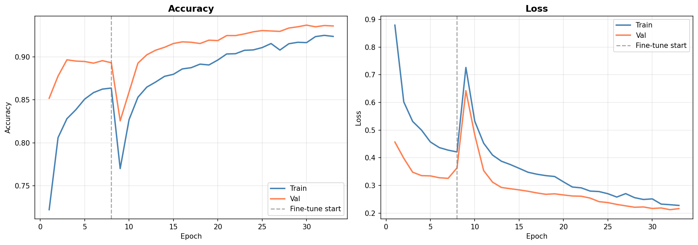
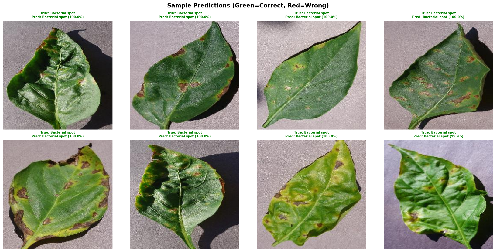

# 🌿 Plant Disease Detection System

A deep learning system for detecting and classifying plant diseases from leaf images using CNNs.

##  Results

| Metric | Value |
|--------|-------|
| Test Accuracy | 93.02% |
| Dataset | PlantVillage |
| Classes | 15 |
| Backbone | MobileNetV2 |

##  Project Structure
```
├── models/
│   ├── plant_disease_model.h5
│   ├── class_names.json
│   └── model_metadata.json
├── results/
│   ├── training_curves.png
│   ├── confusion_matrix.png
│   └── sample_predictions.png
├── notebooks/
│   └── Plant_Disease_Detection.ipynb
├── src/
│   └── predict.py
└── requirements.txt
```


##  Pipeline
1. **Data** — PlantVillage dataset (54,000+ images, 38 disease classes)
2. **Preprocessing** — Resize 224×224, normalize, 80/10/10 split
3. **Augmentation** — Rotation, flips, zoom, brightness, shear
4. **Model** — MobileNetV2 + custom classification head
5. **Training** — Two-phase: head training → fine-tuning
6. **Evaluation** — Confusion matrix, per-class accuracy, top-k predictions

##  Results



##  Applications
- Early disease detection for precision agriculture
- Reducing crop loss through timely intervention
